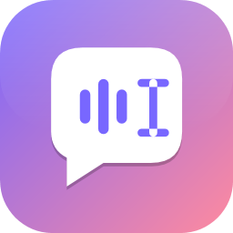
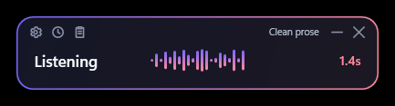
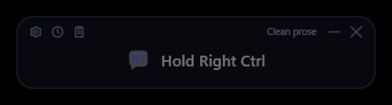
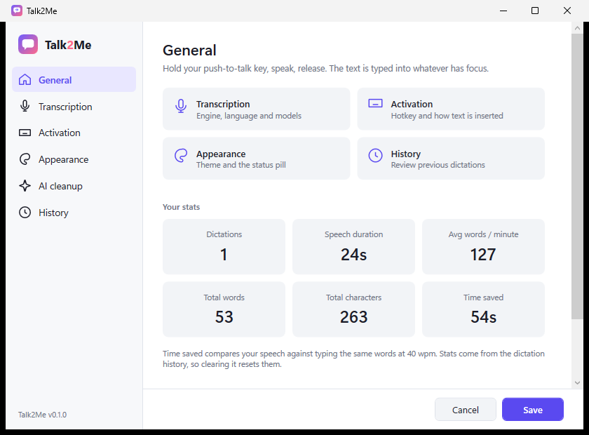

<div align="center">



# Talk2Me

**Push-to-talk dictation for Windows.** Hold a key, speak, release — cleaned-up text is typed
into whatever you were working in.



</div>

Speech recognition runs **on your machine**. There is no account, no subscription and no telemetry.
The only thing that can ever leave your computer is the optional Claude rewrite, which is off until you
turn it on and give it a key.

---

## What it does

Hold **Right Ctrl** (or whichever key you pick), talk, let go. A second or two later the text appears
where your cursor is — in your editor, your browser, a chat box, anywhere.

- **Two local engines.** NVIDIA Parakeet TDT 0.6B v3 for English and 24 other European languages, OpenAI
  Whisper `large-v3-turbo` for the rest. Talk2Me picks per language, or you can force one.
- **It knows where it can type.** Before typing it checks whether the focused element actually accepts
  text, and whether the target window is running as administrator — synthetic keystrokes to an elevated
  window are discarded by Windows without any error. If it can't type, the text goes to your clipboard
  and the bar says *Copied instead*.
- **Nothing is lost.** Every dictation is kept locally, so one that went into the wrong window is a
  click away. Turn the log off and it means it — nothing keeps a second copy of your words.
- **A dictation box when delivery fails.** If the text could not be typed, it waits in an editable
  scratchpad you can copy from, correct, or send back to the window it was aimed at. It never opens
  itself over what you were doing — the bar tells you, and you open it when you want it.
- **Hold, or toggle.** Hold the key for a sentence; set an optional second key that starts and stops
  with a press each, for long passages or when holding is awkward. **Esc** abandons either — nothing is
  typed, nothing is recorded.
- **Your own words.** Names Talk2Me should spell your way, corrections for what it keeps mishearing, and
  saved text you insert by saying *"insert"* and a trigger. All of it works on this machine, with or
  without a Claude key, and the whole vocabulary imports and exports as a file of its own.
- **Optional AI cleanup.** With a Claude API key, dictations are rewritten before typing: spoken
  corrections applied ("no, make that Tuesday"), lists formatted. Your vocabulary is re-applied
  afterwards, so a rewrite can never undo a correction you wrote down.

## Install it

Download **Talk2MeApp-win-Setup.exe** from the
[latest release](https://github.com/JupitorStudioDev/Talk2Me/releases/latest) and run it. It installs
per-user, needs no administrator rights, and updates itself from that same release feed.

> **Windows will warn you the first time.** Talk2Me is not code-signed yet, so SmartScreen shows
> *"Windows protected your PC"*. Choose **More info** → **Run anyway**. That warning is about the
> absence of a paid certificate, not about anything found in the file.

The installer is around 37 MB. Speech models are **not** included — Talk2Me downloads the one your
chosen engine needs on first use, so you only fetch what you actually run.

Or [run from source](#running-from-source).

## Requirements

- Windows 10 or 11
- A microphone

A GPU is optional. Whisper uses Vulkan when a current GPU driver is present and falls back to the CPU;
Parakeet runs on the CPU and is fast enough there. **No CUDA Toolkit, no Python, no Rust.**

Running from source needs the [.NET 8 SDK](https://dotnet.microsoft.com/download/dotnet/8.0); the
installer needs only the .NET 8 Desktop Runtime, and offers to fetch it.

## Running from source

```bash
git clone https://github.com/JupitorStudioDev/Talk2Me.git
cd Talk2Me
dotnet run --project src/Talk2Me.App
```

Talk2Me lives in the system tray and on the taskbar. On first run it downloads the active engine's model
— Parakeet is 640 MB, Whisper `large-v3-turbo` is 1.6 GB — into
`%LOCALAPPDATA%\Jupitor Studio\Talk2Me\models`. The
status bar shows the download progress.

Then hold Right Ctrl and talk.

## The status bar



It sits on screen, dimmed, showing your hotkey; the moment you speak it comes back to full strength with
a live level meter and a timer. Its toolbar has Settings, History, Copy last dictation, minimise, and
hide-between-dictations. Drag it anywhere — it remembers where, per monitor.

**It never takes focus.** The window is `WS_EX_NOACTIVATE`, so Windows delivers your clicks but never
activates it. Press a button or drag it and your caret stays exactly where it was.

## Settings



Seven pages, light or dark or following Windows:

| Page | What's there |
|---|---|
| **General** | Overview, your dictation stats, where the files live |
| **Transcription** | Engine, language, microphone, and managing downloaded models |
| **Activation** | Push-to-talk key, optional toggle key, tap threshold, how text gets inserted, sounds, recording limit |
| **Appearance** | Theme, and where the status bar sits |
| **Vocabulary** | Spellings, replacements and snippets — with import and export |
| **AI cleanup** | The optional Claude rewrite |
| **History** | Everything you've dictated, and the log's settings |

Pick a hotkey by clicking the box and **holding the keys you want**, rather than typing their names. A
number that a box cannot use says so underneath, and Save waits until it is fixed — nothing is dropped
silently or clamped to something you did not choose.

## AI cleanup (optional, off by default)

The built-in cleaner strips "um" and fixes spacing. It cannot tell that *"the deadline is Monday, no
wait, make that Tuesday"* should come out as **"The deadline is Tuesday."** That needs a model.

Turn it on in Settings and paste an [Anthropic API key](https://console.anthropic.com/). The key is
encrypted with DPAPI under your Windows account in `apikey.dat` — never in `settings.json`.
`ANTHROPIC_API_KEY` works too.

When it's on, **the transcript** — not the audio — is sent to the Anthropic API. If the call is slow
(2 s by default), fails, or you have no key, the plain cleaned-up text is typed instead, so a dead
network degrades dictation rather than breaking it.

The prompt is explicit that the transcript is speech to be typed, never an instruction. Dictate *"write
me a poem about the sea"* and you get that sentence, not a poem.

## Where your data lives

Everything is under `%LOCALAPPDATA%\Jupitor Studio\Talk2Me\` — deliberately separate from the
application itself, which the installer puts in `%LOCALAPPDATA%\Talk2MeApp\`, so uninstalling Talk2Me
never takes your models and history with it:

| File | What |
|---|---|
| `settings.json` | All settings. Plain text |
| `apikey.dat` | Your Anthropic key, DPAPI-encrypted for your Windows account |
| `history.jsonl` | Every dictation. **Plain text** — turn it off in Settings → History if that's not for you, and the file is deleted rather than merely hidden |
| `models\` | Downloaded speech models |
| `logs\talk2me.log` | Rolling 5 MB debug log. Records how long and how many characters, **never the words themselves** |

## Performance

Measured on an i7-11700F with an RTX 4060 Ti, same 13-second clip, best of 5:

| Engine | Runs on | Load | Transcribe |
|---|---|---|---|
| Parakeet TDT 0.6B v3 (int8) | CPU, 8 threads | 3.9 s | 931 ms |
| Whisper large-v3-turbo | GPU (Vulkan) | 2.4 s | 413 ms |

Both transcripts were identical and correctly punctuated. Typical end-to-end: 3.2 s of speech typed in
215 ms.

## Developer tools

```bash
dotnet test                                              # 247 unit tests, ~2 s
dotnet run --project tools/Talk2Me.Bench -- speech.wav Both 5
dotnet run --project tools/Talk2Me.Clean -- "um the deadline is monday no wait tuesday"
dotnet run --project tools/Talk2Me.Focus -- 15           # what the focus probe sees
dotnet run --project tools/Talk2Me.Brand                 # regenerate the icon and logos
```

Launch flags: `--settings`, `--history`, `--dictation-box`, `--overlay-demo`.

The version comes from the last release tag — `git describe` — so a local build reports the release it
descends from rather than a number someone forgot to bump. `-p:Version` still wins where it matters.

To build an installer locally:

```bash
./build/pack.ps1 -Version 0.2.9
```

Releases are cut by tagging: `git tag v0.2.9 && git push origin v0.2.9` runs
`.github/workflows/release.yml`, which tests, packs and publishes the GitHub Release that installed
copies update from.

`docs/ARCHITECTURE.md` explains the design and `docs/HANDOFF.md` is the working notes, including the
gotchas that cost the most time. `docs/REVIEW-2026-09-11.md` and `docs/FEATURE-RESEARCH-2026-09-11.md`
are point-in-time assessments, each carrying a note of what has been addressed since.

## Credits

Talk2Me leans on other people's work:

- **[NVIDIA Parakeet TDT 0.6B v3](https://huggingface.co/nvidia/parakeet-tdt-0.6b-v3)** — © NVIDIA
  Corporation, used unmodified under [CC BY 4.0](https://creativecommons.org/licenses/by/4.0/), via the
  [ONNX int8 export](https://huggingface.co/csukuangfj/sherpa-onnx-nemo-parakeet-tdt-0.6b-v3-int8) by
  csukuangfj
- **[OpenAI Whisper](https://huggingface.co/openai/whisper-large-v3-turbo)** — MIT
- **[sherpa-onnx](https://github.com/k2-fsa/sherpa-onnx)** (Apache-2.0) and
  **[Whisper.net](https://github.com/sandrohanea/whisper.net)** (MIT) run them
- **[Wispr Flow](https://wisprflow.ai)** is the product this is modelled on

Full list, with licences: [THIRD-PARTY-NOTICES.md](THIRD-PARTY-NOTICES.md).

## Licence

**None yet — all rights reserved.** You're welcome to read the source. You do not currently have
permission to use, copy, modify or distribute it. If you'd like to, open an issue and ask.

Built by [Jupitor Studio](https://github.com/JupitorStudioDev).
